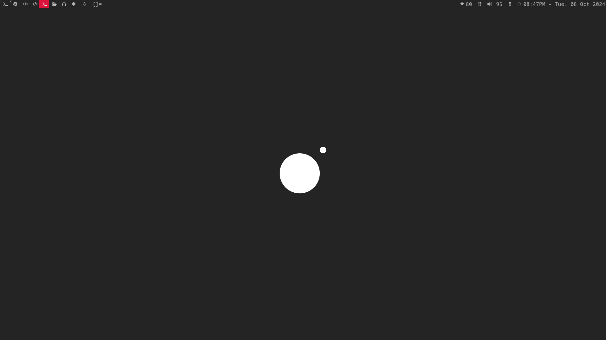
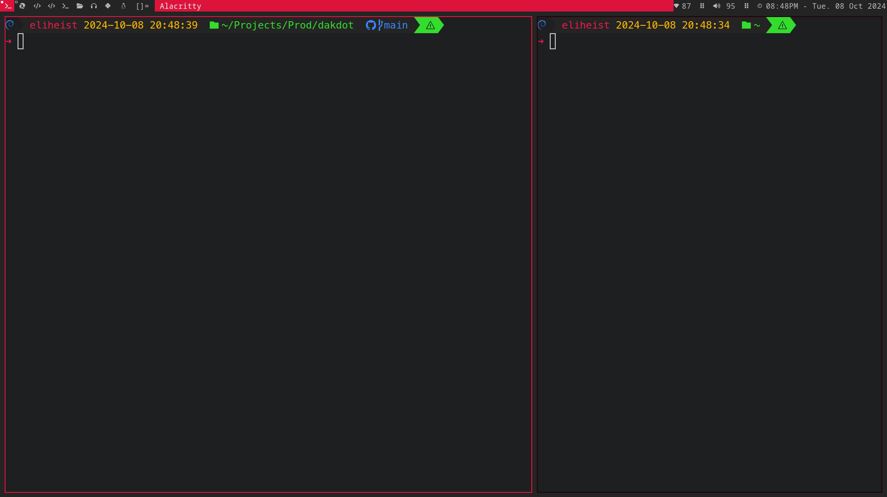

# heistScripts

Customised Scripts for a custom DWM linux setup.

## Table of contents
1. [Screenshots](#Screenshots)

2. [Installation Instructions](#Installation)
# Screenshots






# Installation

Clone the repo and copy the scripts to your home folder.

### Install Xserver
```bash
sudo apt install xserver-xorg-core xinit xinput x11-xserver-utils
```

For intel gpu
```bash
sudo apt install xserver-xorg-video-intel
```

For Nvidia gpu
```bash
sudo apt install xserver-xorg-video-nvidia
```

For amd gpu
```bash
sudo apt install xserver-xorg-video-amdgpu
```

### Install build tools and other tools
```bash
sudo apt install build-essential libx11-dev libxinerama-dev libxft-dev git make alacritty pipewire feh network-manager
```

### Install neovim
```bash
curl -LO https://github.com/neovim/neovim/releases/latest/download/nvim-linux64.tar.gz
sudo rm -rf /opt/nvim
sudo tar -C /opt -xzf nvim-linux64.tar.gz
```
Snippet from [Neovim Installation Page](https://github.com/neovim/neovim/blob/master/INSTALL.md) 
I used this method because `sudo apt install neovim` installed an older version that does not support lazy

### Configuration
1. Create a central location for downloaded repos
```bash
mkdir ~/.Git && cd ~/.Git
```

2. clone this repo
```bash
git clone https://github.com/eliHeist/heistscripts.git
```

3. Copy the files to the home folder
```bash
cp heistscripts/root/* ~/
```

4. Change to the dwm folder
```bash
cd ~/.config/dwm
```

5. Run make and make sure there are no errors
```bash
make
```

5. Then install if there were no errors
```bash
sudo make clean install
```

### Start xserver
```bash
startx
```

**NOTE:** If the resolution is not right, use `xrandr -s 1920x1080` to set to your prefered resolution

You can change the .xinitrc file to autoset the resolution on startup
```bash
xrandr -s 1920x1080 &
feh --bg-scale ~/.config/wallpaper.jpg &
~/bin/dwmbar &
exec dwm
```
